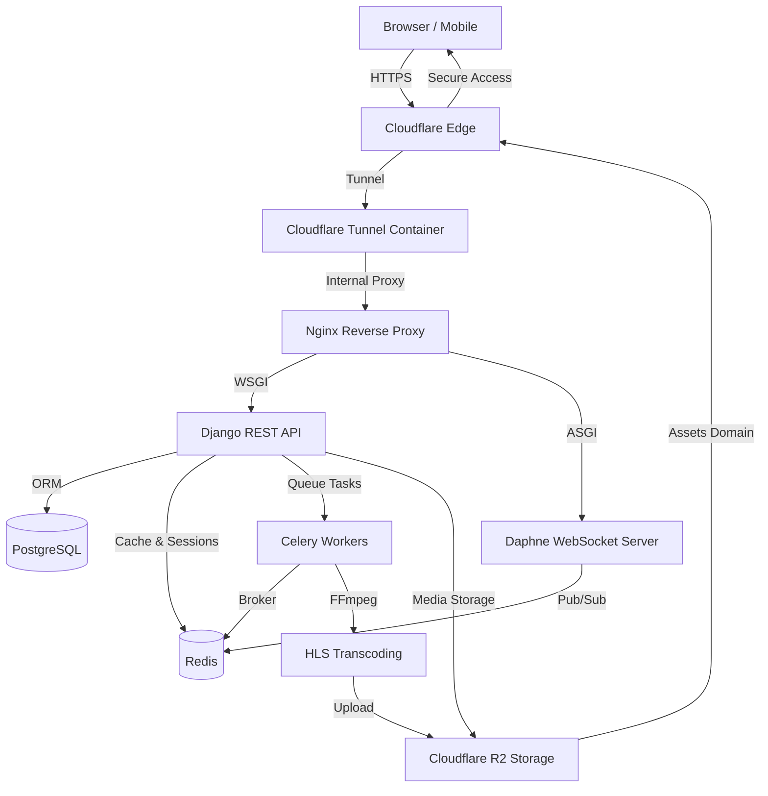
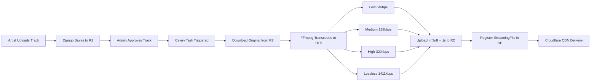
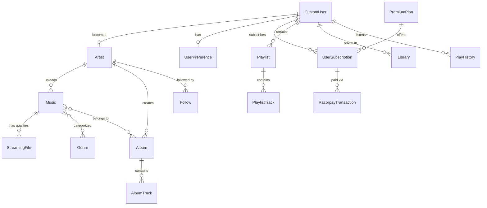

# 🎵 Wave — Music Streaming Platform

<div align="center">
  
  <br />
  <p><em>A full-stack music streaming platform built for artists and listeners</em></p>

  
  
  
  
  
  
</div>

---

## 📋 Table of Contents

- [Overview](#-overview)
- [Features](#-features)
- [Tech Stack](#️-tech-stack)
- [Architecture](#️-architecture)
- [Project Structure](#-project-structure)
- [Installation](#-installation)
- [Environment Variables](#-environment-variables)
- [Development](#-development)
- [API Documentation](#-api-documentation)
- [Deployment](#-deployment)
- [Security](#-security)
- [Contributing](#-contributing)
- [License](#-license)
- [Contact](#-contact)

---

## 🚀 Overview

**Wave** is a feature-rich music streaming platform designed to provide a seamless experience for both artists and listeners. Built with a Django REST Framework backend and a modern React + Vite frontend, Wave delivers:

- **Universal Portability** — Using Cloudflare Tunnel, the backend can be hosted on any machine (Local PC, Raspberry Pi, Cloud VM) without port forwarding or a public IP.
- **Adaptive HLS Streaming** — Audio files are transcoded into multi-quality HLS streams (64kbps → 1411kbps lossless) using FFmpeg and Celery, served via Cloudflare R2.
- **Premium Subscription System** — Integrated Razorpay payment gateway with plan management, subscription tracking, and transaction history.
- **Professional Audio Controls** — 10-band equalizer with built-in presets, adaptive quality selection, and Web Audio API integration.
- **Artist Studio** — A dedicated creative workspace for artists to upload music, create albums, manage tracks, and view analytics.
- **Comprehensive Admin Dashboard** — Platform-wide management of users, artists, music verification, premium plans, and revenue tracking.

---

## ✨ Features

### 🎧 For Listeners

| Feature | Description |
|---------|-------------|
| **Music Discovery** | Personalized home feed with top tracks, trending playlists, and genre-based exploration |
| **Advanced Player** | Mini and full-screen player with queue management, shuffle, repeat, and drag-to-reorder |
| **Playlist Management** | Create, edit, reorder, and share custom playlists with cover art |
| **Library Organization** | Save songs, albums, playlists, and follow artists — all in a unified sidebar |
| **Professional Equalizer** | 10-band EQ with presets (Rock, Pop, Jazz, Classical, Bass Boost, etc.) — Premium only |
| **Adaptive Audio Quality** | Choose streaming quality: Low (64k), Medium (128k), High (320k), or Lossless (1411k) |
| **Listening History** | Track and revisit recently played songs, with automatic play count analytics |
| **Social Sharing** | Share tracks, albums, and playlists via Web Share API |
| **Search & Discover** | Real-time search across tracks and artists with categorized results |
| **Artist Profiles** | Browse artist pages with discography, follower counts, and play statistics |

### 🎤 For Artists

| Feature | Description |
|---------|-------------|
| **Artist Studio** | Dedicated dashboard with analytics, music management, and album creation tools |
| **Music Upload** | Upload tracks with cover art, genre tagging, and automatic metadata extraction via Mutagen |
| **Album Creator** | Full album workflow — create, organize track order with drag-and-drop, schedule releases |
| **Analytics Dashboard** | Real-time statistics: total plays, monthly listeners, follower growth, and top-performing tracks |
| **Music Management** | Edit, unpublish, or delete tracks; manage album contents; update cover art |
| **Verification System** | Submit tracks for admin review before public listing |

### 💎 Premium Features

| Feature | Description |
|---------|-------------|
| **Professional Equalizer** | Unlock the full 10-band equalizer with precision sound controls |
| **Adjustable Audio Quality** | Stream in high-fidelity audio up to 1411kbps (Lossless) |
| **Flexible Plans** | Multiple subscription durations — weekly, monthly, quarterly, and annual plans |
| **Razorpay Payments** | Secure checkout with branded Wave payment experience |

### 🛡️ Admin Dashboard

| Feature | Description |
|---------|-------------|
| **User Management** | View, search, block/unblock user accounts with real-time status |
| **Artist Verification** | Review and approve/reject artist applications |
| **Genre Management** | Create, edit, delete, and list music genres for platform categorization |
| **Music Moderation** | Approve, reject, or block music submissions with paginated verification queue |
| **Premium Plan Management** | Create, edit, and manage subscription plans and pricing |
| **Transaction Monitoring** | Full Razorpay transaction history with status tracking |
| **Platform Analytics** | Dashboard with total users, artists, tracks, revenue, and growth metrics |

---

## 🛠️ Tech Stack

### Backend

<div>
  
  
  
  
  
  
  
  
  
  
  
  
  
</div>

### Frontend

<div>
  
  
  
  
  
  
  
  
  
  
  
</div>

---

## 🏗️ Architecture

### System Architecture


```mermaid
graph TD
    Client[Browser / Mobile] -->|HTTPS| CF[Cloudflare Edge]
    CF -->|Tunnel| CFT[Cloudflare Tunnel Container]
    CFT -->|Internal Proxy| Nginx[Nginx Reverse Proxy]
    Nginx -->|WSGI| Django[Django REST API]
    Nginx -->|ASGI| Daphne[Daphne WebSocket Server]
    Django -->|ORM| PostgreSQL[(PostgreSQL)]
    Django -->|Cache & Sessions| Redis[(Redis)]
    Django -->|Queue Tasks| Celery[Celery Workers]
    Celery -->|Broker| Redis
    Celery -->|FFmpeg| HLS[HLS Transcoding]
    HLS -->|Upload| R2[Cloudflare R2 Storage]
    R2 -->|Assets Domain| CF
    Daphne -->|Pub/Sub| Redis
    Django -->|Media Storage| R2
    CF -->|Secure Access| Client
```

### Audio Processing Pipeline


```mermaid
flowchart LR
    A[Artist Uploads Track] --> B[Django Saves to R2]
    B --> C[Admin Approves Track]
    C --> D[Celery Task Triggered]
    D --> E[Download Original from R2]
    E --> F[FFmpeg Transcodes to HLS]
    F --> G1[Low 64kbps]
    F --> G2[Medium 128kbps]
    F --> G3[High 320kbps]
    F --> G4[Lossless 1411kbps]
    G1 & G2 & G3 & G4 --> H[Upload .m3u8 + .ts to R2]
    H --> I[Register StreamingFile in DB]
    I --> J[Cloudflare CDN Delivery]
```

### Data Model Overview


```mermaid
erDiagram
    CustomUser ||--o| Artist : "becomes"
    CustomUser ||--o| UserPreference : "has"
    CustomUser ||--o{ UserSubscription : "subscribes"
    Artist ||--o{ Music : "uploads"
    Artist ||--o{ Album : "creates"
    Artist ||--o{ Follow : "followed by"
    Music ||--o{ StreamingFile : "has qualities"
    Music }o--o{ Genre : "categorized"
    Music }o--o{ Album : "belongs to"
    Album ||--o{ AlbumTrack : "contains"
    CustomUser ||--o{ Playlist : "creates"
    Playlist ||--o{ PlaylistTrack : "contains"
    CustomUser ||--o{ Library : "saves to"
    CustomUser ||--o{ PlayHistory : "listens"
    PremiumPlan ||--o{ UserSubscription : "offers"
    UserSubscription ||--o{ RazorpayTransaction : "paid via"
```

---

## 📁 Project Structure

### Backend

```
Backend/
├── Backend/                # Django project settings
│   └── settings/
│       ├── base.py         # Shared settings
│       ├── development.py  # Dev overrides
│       └── production.py   # Production overrides
├── users/                  # Custom user model, auth, email verification
├── artists/                # Artist profiles, follow system, verification
├── music/                  # Tracks, albums, genres, HLS streaming, equalizer
│   ├── models.py           # Music, Album, StreamingFile, EqualizerPreset
│   ├── tasks.py            # Celery HLS transcoding tasks
│   ├── services.py         # CloudFront signed URL generation
│   └── signals.py          # Post-approval HLS trigger
├── album/                  # Album-specific serializers & views
├── playlist/               # Playlist CRUD and track management
├── library/                # User's saved content (tracks, albums, playlists)
├── premium/                # Subscription plans, Razorpay integration
├── listening_history/      # Play count tracking and history
├── admins/                 # Admin dashboard API, stats, user management
├── home/                   # Home feed, discovery, and listing endpoints
├── common/                 # Shared constants and utilities
├── templates/              # Email templates (OTP, verification)
├── Dockerfile              # Production Docker image
├── docker-compose.yml      # Multi-service orchestration
├── nginx.conf              # Nginx reverse proxy config
└── requirements.txt        # Python dependencies
```

### Frontend

```
Frontend/src/
├── components/
│   ├── player/             # Music player (Mini, Full, Queue, Controls, Progress)
│   │   ├── Player.tsx      # Main player orchestrator
│   │   ├── MiniPlayer.tsx  # Compact bottom bar player
│   │   ├── FullPlayer.tsx  # Full-screen immersive player
│   │   └── QueueSheet.tsx  # Drag-to-reorder queue panel
│   ├── admin/              # Admin dashboard components
│   │   ├── Dashboard.jsx   # Analytics & stats overview
│   │   ├── UsersTable.jsx  # User management table
│   │   ├── ArtistVerification.jsx
│   │   ├── PremiumPlansManagement.jsx
│   │   ├── TransactionSession.jsx
│   │   └── music_section/  # Music verification workflow
│   ├── artist/
│   │   └── studio/         # Artist creation tools
│   │       ├── Studio.jsx           # Studio layout & navigation
│   │       ├── DashboardStats.jsx   # Artist analytics
│   │       ├── MusicManagement.jsx  # Track management
│   │       ├── AlbumCreator.jsx     # Album creation wizard
│   │       └── music_uploader/      # Multi-step upload flow
│   └── user/
│       ├── home/
│       │   ├── header/     # Navigation, search, premium, profile, settings
│       │   │   └── settings/
│       │   │       ├── EqualizerControl.jsx  # 10-band EQ
│       │   │       └── Settings.jsx          # User preferences
│       │   ├── sidebar/    # Library, playlists, followed artists
│       │   ├── main-content/  # Home feed sections
│       │   ├── playlist/   # Playlist detail pages
│       │   └── album/      # Album detail page
│       ├── login/          # Login with email/password + Google OAuth
│       └── register/       # Multi-step registration with OTP
├── hooks/                  # Custom React hooks
│   ├── useAudioPlayer.ts   # HLS playback with hls.js
│   ├── useEqualizer.ts     # Web Audio API equalizer
│   ├── useMediaSession.ts  # OS media controls (lock screen)
│   ├── usePlayCollection.ts # Album/playlist play logic
│   └── usePlayTracking.ts  # Play count analytics
├── slices/                 # Redux Toolkit state management
│   └── user/
│       ├── playerSlice.ts  # Player state, queue, shuffle, repeat
│       ├── librarySlice.js # Library state & async thunks
│       ├── equalizerSlice.js
│       └── userSlice.js    # Auth state
├── middleware/
│   └── playerMiddleware.js # Side-effect handling for player actions
├── services/               # API service modules
├── constants/              # API endpoints, config
├── utils/                  # Shared utilities
└── App.jsx                 # Route definitions
```

---

## 📥 Installation

> [!TIP]
> **Host Anywhere:** Because this project uses **Cloudflare Tunnel**, you can host it on any machine (including your home computer or a laptop behind a router) without needing to configure port forwarding or your router's firewall.

### Prerequisites

- **Docker & Docker Compose** (Recommended for full stack)
- **Cloudflare Account** (For Tunnel and R2 storage)
- **Python** 3.12+ (For local development)
- **Node.js** 18+ & npm (For frontend)
- **PostgreSQL** 15+
- **Redis** 7+
- **FFmpeg** (for HLS transcoding)

### Backend Setup

```bash
# Clone the repository
git clone https://github.com/affilpm/wave.git
cd wave/Backend

# Create and activate virtual environment
python -m venv env
source env/bin/activate  # On Windows: env\Scripts\activate

# Install dependencies
pip install -r requirements.txt

# Set up environment variables
cp .env.example .env
# Edit .env with your actual values

# Run database migrations
python manage.py migrate

# Create superuser for admin access
python manage.py createsuperuser

# Start development server
python manage.py runserver
```

### Frontend Setup

```bash
# Navigate to frontend
cd wave/Frontend

# Install dependencies
npm install

# Start development server
npm run dev
```

### Docker Setup (Production-ready)

1. **Configure Environment**:
   Ensure your `.env` file in the `Backend/` directory is fully populated (see [Environment Variables](#-environment-variables)).

2. **Cloudflare Tunnel Setup**:
   - Create a tunnel in the Cloudflare Dashboard (**Zero Trust > Networks > Tunnels**).
   - Set the public hostname to `api-wave.yourdomain.com` pointing to `http://nginx:80`.
   - Copy the **Tunnel Token** and add it to your `.env` as `CLOUDFLARE_TUNNEL_TOKEN`.

3. **Cloudflare R2 Setup**:
   - Create an R2 bucket named `wave`.
   - Add a custom domain `assets-wave.yourdomain.com` to the bucket.
   - Generate R2 API tokens (Access Key & Secret Key).

4. **Launch Services**:
   ```bash
   cd Backend
   docker-compose up -d --build
   ```

5. **Collect Static Files**:
   ```bash
   docker exec wave-backend python manage.py collectstatic --noinput
   ```

The backend is now accessible via your Cloudflare custom domain.

---

## 🔑 Environment Variables

Copy `Backend/.env.example` to `Backend/.env` and configure:

| Variable | Description | Required |
|----------|-------------|----------|
| `SECRET_KEY` | Django secret key | ✅ |
| `DEBUG` | Debug mode (`True`/`False`) | ✅ |
| `ALLOWED_HOSTS` | Comma-separated list of domains | ✅ |
| `CLOUDFLARE_TUNNEL_TOKEN` | Token for the wave_tunnel service | ✅ |
| `USE_S3_MEDIA_STORAGE` | Enable R2/S3 storage (`True`/`False`) | ✅ |
| `AWS_S3_ENDPOINT_URL` | Cloudflare R2 S3 API URL | ⚡ Production |
| `R2_CUSTOM_DOMAIN` | Domain for assets (e.g. `assets-wave.yourdomain.com`) | ⚡ Production |
| `AWS_ACCESS_KEY_ID` | R2 API Access Key | ⚡ Production |
| `AWS_SECRET_ACCESS_KEY` | R2 API Secret Key | ⚡ Production |
| `AWS_STORAGE_BUCKET_NAME`| Name of your R2 bucket | ⚡ Production |
| `DB_NAME`, `DB_USER`... | PostgreSQL credentials | ✅ |
| `REDIS_URL` | Redis connection string | ✅ |
| `EMAIL_HOST_USER`... | SMTP credentials for OTP emails | ✅ |
| `SOCIAL_AUTH_GOOGLE...` | Google OAuth2 credentials | ✅ |
| `RAZOR_KEY_ID`... | Razorpay payment gateway keys | ✅ |

---

## 💻 Development

### Running All Services

```bash
# Terminal 1 — Backend
cd Backend && python manage.py runserver

# Terminal 2 — Celery Worker (for HLS transcoding)
cd Backend && celery -A Backend worker -l info

# Terminal 3 — Redis (if not using Docker)
redis-server

# Terminal 4 — Frontend
cd Frontend && npm run dev
```

### Key Development Commands

```bash
# Backend
python manage.py makemigrations    # Create migration files
python manage.py migrate           # Apply migrations
python manage.py createsuperuser   # Create admin account
python manage.py shell_plus        # Enhanced Django shell
python manage.py show_urls         # List all registered URLs

# Frontend
npm run dev                        # Start dev server (port 5173)
npm run build                      # Production build
npm run lint                       # ESLint check
```

---

## 📖 API Documentation

Wave exposes a comprehensive RESTful API. All endpoints are prefixed with `/api/v1/`.

### 🔐 Authentication

| Method | Endpoint | Description |
|--------|----------|-------------|
| `POST` | `/users/register/` | User registration with email |
| `POST` | `/users/verify-otp/` | Verify email OTP |
| `POST` | `/users/login/` | Login (returns JWT tokens) |
| `POST` | `/users/token/refresh/` | Refresh access token |
| `POST` | `/users/google/` | Google OAuth2 login |
| `POST` | `/users/logout/` | Logout (blacklists refresh token) |

### 🎵 Music & Albums

| Method | Endpoint | Description |
|--------|----------|-------------|
| `GET` | `/music/music/` | List approved tracks (paginated) |
| `POST` | `/music/music/` | Upload new track (artists only) |
| `GET` | `/music/music/{id}/stream/` | Get HLS streaming URLs (signed) |
| `POST` | `/music/music/{id}/update_album/` | Change or remove album assignment |
| `GET` | `/music/albums/` | List published albums |
| `POST` | `/music/albums/` | Create album with tracks |
| `GET/POST/PUT/DELETE` | `/music/genres/` | List all genres (CRUD for admins) |
| `GET/PUT` | `/music/user-preference/` | Get/set streaming quality |

### 📋 Playlists & Library

| Method | Endpoint | Description |
|--------|----------|-------------|
| `GET/POST` | `/playlist/playlist-data/` | List/create playlists |
| `POST` | `/playlist/playlist-data/{id}/add_track/` | Add track to playlist |
| `GET` | `/library/library/playlists/` | Saved playlists |
| `GET` | `/library/library/albums/` | Saved albums |
| `POST` | `/library/library/toggle/` | Add/remove from library |

### 🎤 Artists

| Method | Endpoint | Description |
|--------|----------|-------------|
| `GET` | `/artists/{id}/` | Artist profile & tracks |
| `POST` | `/artists/{id}/follow/` | Follow artist |
| `POST` | `/artists/{id}/unfollow/` | Unfollow artist |
| `GET` | `/artists/me/following/` | List followed artists |
| `GET` | `/artists/check-artist-status/` | Check if current user is an artist |
| `GET` | `/artists/dashboard-stats/` | Artist analytics data |

### 💰 Premium & Payments

| Method | Endpoint | Description |
|--------|----------|-------------|
| `GET` | `/premium/plans/` | List subscription plans |
| `POST` | `/premium/create-order/` | Create Razorpay order |
| `POST` | `/premium/verify-payment/` | Verify payment & activate subscription |
| `GET` | `/premium/check-subscription-status/` | Check premium status |
| `GET` | `/premium/transaction-history/` | Payment history |

### 🛡️ Admin

| Method | Endpoint | Description |
|--------|----------|-------------|
| `GET` | `/admins/dashboard-stats/` | Platform-wide analytics |
| `GET` | `/admins/users/` | List all users |
| `POST` | `/admins/users/{id}/block/` | Block/unblock user |
| `GET` | `/music/verification/` | Pending music submissions |
| `POST` | `/music/verification/{id}/approve/` | Approve track |
| `POST` | `/music/verification/{id}/reject/` | Reject track |

---

## 🚢 Deployment

### Production Architecture

```
                    ┌──────────────────┐
                    │   CloudFront CDN  │ ← HLS segments + static assets
                    └────────┬─────────┘
                             │
┌──────────┐    ┌────────────┴──────────┐    ┌──────────────┐
│  Client   │──→│   Nginx (SSL + Proxy) │──→│  Daphne/ASGI │ ← WebSockets
│ (Browser) │    └────────────┬──────────┘    └──────────────┘
└──────────┘                 │
                    ┌────────┴─────────┐
                    │  Django (Gunicorn)│
                    └────────┬─────────┘
              ┌──────────────┼──────────────┐
              │              │              │
     ┌────────┴───┐  ┌──────┴─────┐  ┌─────┴─────┐
     │ PostgreSQL  │  │   Redis    │  │  Celery   │
     │  Database   │  │  Cache +   │  │  Workers  │
     │             │  │  Broker    │  │  (FFmpeg) │
     └─────────────┘  └────────────┘  └─────┬─────┘
                                            │
                                      ┌─────┴─────┐
                                      │ Cloudflare │
                                      │ R2 Storage │
                                      └───────────┘
```

### Quick Deploy

> [!TIP]
> **Resource Efficient:** The production Docker setup is optimized to run smoothly even on low-resource (1GB RAM) environments, featuring an Nginx reverse proxy serving static/media files, Redis memory tuning, and constrained Celery workers.

```bash
# Production Launch
cd Backend
docker-compose up -d --build

# Run migrations and collect static
docker exec wave-backend python manage.py migrate
docker exec wave-backend python manage.py collectstatic --noinput
```

### Production Checklist

- [ ] Set `DEBUG=False` in `.env`
- [ ] Configure `ALLOWED_HOSTS` with your production domains
- [ ] Create Cloudflare Tunnel and set `CLOUDFLARE_TUNNEL_TOKEN`
- [ ] Set up Cloudflare R2 bucket and configure `R2_CUSTOM_DOMAIN`
- [ ] Ensure `USE_S3_MEDIA_STORAGE=True`
- [ ] Set up Google OAuth2 for production callback URLs
- [ ] Set up Razorpay Live keys
- [ ] Enable PostgreSQL connection pooling
- [ ] Configure Redis persistence
- [ ] Set up monitoring and logging

---

## 🔒 Security

Wave implements multiple layers of security:

| Layer | Implementation |
|-------|---------------|
| **Authentication** | JWT with short-lived access tokens (5 min) + rotating refresh tokens |
| **Token Blacklisting** | Revoked tokens are blacklisted via `simplejwt.token_blacklist` |
| **CORS** | Strict cross-origin policy — only whitelisted frontend domains |
| **CSRF Protection** | Django CSRF middleware with trusted origins |
| **Content Security Policy** | CSP headers via `django-csp` to prevent XSS |
| **Password Validation** | Enforced minimum length, complexity, and common password checks |
| **Rate Limiting** | Throttling on auth endpoints to prevent brute force attacks |
| **Signed URLs** | Cloudflare signed URLs/tokens for media access with expiration |
| **HTTPS Enforcement** | SSL redirect in production |
| **OTP Verification** | Email-based OTP for user registration |
| **Input Validation** | DRF serializers with field-level validation on all endpoints |

---

## 🤝 Contributing

Contributions are welcome! Please follow the workflow below:

1. **Fork** the repository
2. **Create** your feature branch
   ```bash
   git checkout -b feat/your-feature-name
   ```
3. **Commit** with conventional commits
   ```bash
   git commit -m "feat: add new feature description"
   ```
4. **Push** to your fork
   ```bash
   git push origin feat/your-feature-name
   ```
5. **Open** a Pull Request against `main`

### Commit Convention

| Prefix | Usage |
|--------|-------|
| `feat:` | New features |
| `fix:` | Bug fixes |
| `refactor:` | Code improvements (no behavior change) |
| `ui:` | Visual/styling changes |
| `docs:` | Documentation updates |
| `chore:` | Maintenance tasks |

---

## 📜 License

This project is licensed under the **MIT License** — see the [LICENSE](LICENSE) file for details.

---

## 📞 Contact

**AFFIL P M**

📧 [affilpm2004@gmail.com](mailto:affilpm2004@gmail.com)

### 🌐 Social Media

- **LinkedIn:** [linkedin.com/in/affilpm](https://www.linkedin.com/in/affil-p-m-b9a2b2299)
- **Instagram:** [instagram.com/affil_pm_](https://www.instagram.com/affil_pm_)

### 🔗 Project Links

- **Repository:** [github.com/affilpm/wave](https://github.com/affilpm/wave)
- **Backend:** [GitHub - Wave Backend](https://github.com/affilpm/Wave/tree/main/Backend)
- **Frontend:** [GitHub - Wave Frontend](https://github.com/affilpm/Wave/tree/main/Frontend)

---

<div align="center">
  
  <br />
  <sub>Built with ❤️ by <a href="https://github.com/affilpm">AFFIL P M</a></sub>
  <br />
  <sub>© 2025 Wave. All rights reserved.</sub>
</div>